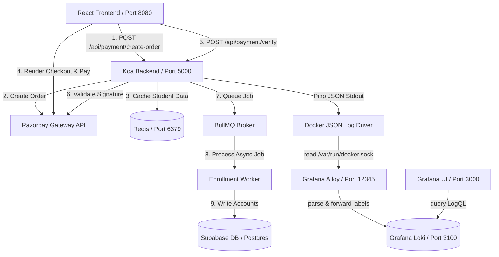

# EzyIntern System Architecture & Observability Guide

This document describes the end-to-end architecture of the EzyIntern platform, detailing how the React/Vite client, Koa.js backend, Supabase database, and the Grafana-Loki-Alloy observability stack interact.

---

## 1. System Topology & Data Flow

Below is the request and telemetry flow of the application during the student registration and payment lifecycle:



---

## 2. Technology Stack Roles

### A. Frontend (Client)
*   **Vite & React**: Compiles and serves the student registration and payment dashboards (locally on port `8080`).
*   **Supabase JS Client**: Interacts directly with public tables (like `colleges` and `universities`) using Row Level Security (RLS) policies.
*   **Axios Client**: Communicates with the stateful Koa backend for payment orchestrations under the `/api` route prefix.

### B. Backend (Server)
*   **Koa.js (Node.js)**: High-performance backend hosting API endpoints.
*   **Redis**: Caches temporary student registration payloads (1 hour expiry) during order processing and acts as the broker for BullMQ.
*   **BullMQ**: Handles asynchronous background job queues (`enrollment-queue`) to register users in Supabase, preventing API timeouts.
*   **Pino**: Lightweight structured logger emitting JSON payloads containing correlation metadata like `requestId` and `traceId`.

### C. Database & Auth (Supabase)
*   **Supabase Auth (GoTrue)**: Handles user authentication sessions.
*   **Postgres Triggers (`handle_new_user`)**: Safely updates `public.profiles` automatically when new users sign up, using default values to avoid NOT NULL violations.

### D. Observability Pipeline
*   **Grafana Alloy**: Scrapes Docker logs, looks for the metadata label `ezyintern.logging: "enabled"`, parses the Pino JSON format, extracts attributes, and routes them to Loki.
*   **Grafana Loki**: Log aggregation database.
*   **Grafana Dashboard**: Web interface configured with Loki data sources for querying system traces and errors.

---

## 3. Core Request Flows

### A. Registration & Payment Creation
1. The student completes the multi-step form (Personal, Academic, Emergency, Security, Consent).
2. The client calls `POST /api/payment/create-order`.
3. The server checks database availability (`check_student_registration_available`).
4. If available, the server requests an order ID from Razorpay and caches the student registration payload in Redis keyed by `reg_temp:order_id`.
5. The backend returns the order details to the frontend.

### B. Payment Verification & Queueing
1. The frontend displays the Razorpay overlay.
2. The user pays successfully and Razorpay returns a verification signature.
3. The client calls `POST /api/payment/verify` with the signature.
4. The server verifies the signature locally using the HMAC SHA256 secret.
5. If valid, the server pushes the cached Redis student payload to a BullMQ queue job and returns success immediately.

### C. Async Enrollment & Polling
1. The `EnrollmentWorker` picks up the job.
2. It calls the Supabase Admin SDK to securely create the auth user (`auth.admin.createUser`) and inserts a row in `public.students`.
3. Meanwhile, the client polls `GET /api/payment/status/:orderId` every 2 seconds.
4. When the worker finishes processing and updates status to `fulfilled`, the client resolves the loader and logs the user in.

---

## 4. Observability Operations & Commands

Use the following commands to check, debug, and monitor logs, traces, and metrics in development:

### A. Managing the Observability Containers
Start Loki, Alloy, and Grafana in the background:
```bash
docker compose up -d loki alloy grafana
```

Verify that the containers are healthy:
```bash
docker compose ps
```

### B. Accessing Grafana
1. Open your browser and navigate to **`http://localhost:3000`**.
2. Log in using the default developer credentials:
   *   **Username**: `admin`
   *   **Password**: `admin`
3. Go to **Explore** and select the **Loki** data source.

### C. Analyzing Logs via LogQL (Loki)

To filter logs specifically for our backend service:
```logql
{service="ezyintern-server"}
```

To find only **error** and **fatal** logs:
```logql
{service="ezyintern-server"} | json | level =~ "error|fatal"
```

To trace a single user session using a specific **Request ID** or **Trace ID**:
```logql
{service="ezyintern-server"} | json | requestId="YOUR_REQUEST_ID"
```
```logql
{service="ezyintern-server"} | json | traceId="YOUR_TRACE_ID"
```

To monitor **request latencies** (p95 HTTP response times) extracted from JSON logs:
```logql
quantile_over_time(0.95, {service="ezyintern-server", logType="http"} | json | unwrap durationMs [5m])
```
