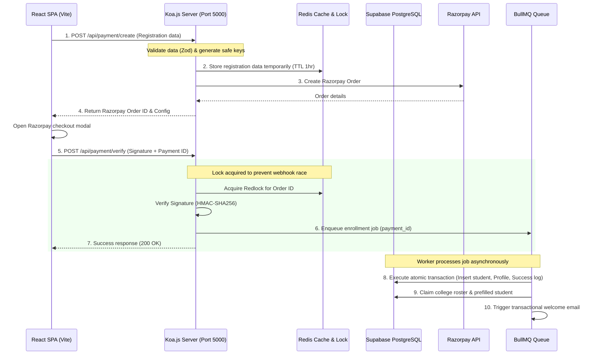

# Koa.js Backend Migration & Security Hardening Plan

This plan details the transition of the **EzyIntern** codebase from Vercel Serverless Functions and heavy client-side database access to a robust, secure, stateful **Koa.js Node.js server**. 

---

## User Review Required

> [!IMPORTANT]
> **Host Migration**: Moving to a continuous stateful Koa backend requires deploying the server on a platform that supports continuous processes (such as Docker on AWS ECS/App Runner, Render, Railway, or VPS), rather than Vercel Serverless.
>
> **Supabase RLS Lockdown**: All write operations for anonymous users and students must be removed from the database policies. Only the Koa backend (using a secure database connection or Supabase service-role client) will have write privileges to critical tables.

---

## Open Questions

> [!WARNING]
> 1. **Do we use Supabase Auth or migrate to a custom JWT-based authentication in Koa?** Sticking to Supabase Auth is possible via the Supabase Node SDK (Koa verifies Supabase tokens), but moving to Koa gives the freedom to use custom JWT sessions.
> 2. **Which Message Queue broker do you prefer?** We propose **BullMQ** (powered by Redis), as we are already using Redis for caching and locking.

---

## Proposed Changes & Architecture

### Redesigned System Architecture

---

### Component-Level Migration Details

#### 1. Client-Side Cleanup (Vite React App)
* **Remove Direct Writes**: Remove all direct `supabase.auth.signUp`, `supabase.from("students").insert`, and `supabase.from("payment_success").insert` calls from `RegistrationForm.tsx` and `PrefilledRegistrationForm.tsx`.
* **API Redirection**: Change form submission to hit Koa API endpoints (e.g. `/api/auth/register` and `/api/payment/verify-signature`).
* **Reduce State Management**: The client should only capture user data, validate schemas, trigger Razorpay modal, and await Koa's verification status.

#### 2. Koa.js Core Structure
* **Server Entry (`server.ts`)**: Setup Koa instance, routing, body parser (`koa-bodyparser`), CORS configuration, and port listener (e.g., port `5000`).
* **Router Routing**:
  * `/api/auth/register`: Takes registration data, validates via Zod, saves to temporary Redis cache, creates Razorpay Order, and returns details.
  * `/api/payment/verify`: Verifies Razorpay HMAC signature, acquires Redis Redlock, and pushes registration tasks to the Message Queue.
  * `/api/payment/webhook`: Handles Razorpay webhook events securely (HMAC verified).
  * `/api/admin/*`: Protected admin routes using JWT middleware verification.
* **Middlewares**:
  * **Auth Middleware**: Parses the `Authorization: Bearer <token>` header, decodes/verifies the token, and mounts the user onto `ctx.state.user`.
  * **Error Middleware**: Global try-catch that logs errors with a Request Correlation ID and returns clean JSON errors.
  * **Rate Limiting Middleware**: Protects routes against denial-of-service/spam using `koa-ratelimit` backed by Redis.

#### 3. Caching & State Management (Redis)
* **Temporary Registration Store**: Save form inputs (including hashed passwords/data) under a Redis key (`reg_temp:order_id`) for 1 hour until payment verification completes. Prevents saving plain-text passwords in databases.
* **Concurrency Locking**: Use `redlock` to ensure that when a payment webhook and client verification occur at the same time, only one execution proceeds.
* **Catalog Caching**: Cache the universities and colleges list to minimize database lookups on the step-by-step forms.

#### 4. Asynchronous Queue (BullMQ)
* **Job Queue (`enrollment-queue`)**: Pushes payment IDs to a Redis-backed queue immediately upon signature validation.
* **Workers**: Background processor to handle the heavy workload:
  * Creates Auth Users via Supabase Admin SDK.
  * Inserts records atomically into `students`, `profiles`, and `payment_success` tables using transactions.
  * Dispatches emails using a transactional email service (e.g. Resend/Postmark API) instead of rate-limited SMTP.
  * Automatic retry with exponential backoff on failures.

#### 5. Logging & Monitoring
* **Structured Logs**: Implement `pino` logger to write JSON structured logs, including response times, request paths, and Correlation IDs.
* **Observability (Prometheus & Sentry)**:
  * Add `/metrics` route with `prom-client` exposing CPU, RAM, active worker queue sizes, and request counts/latencies.
  * Sentry middleware to catch, report, and alert on application exceptions.

---

## Verification Plan

### Automated Tests
- Integration tests in Koa to verify signature verification handles invalid cases.
- Performance tests (e.g., using `autocannon` or `k6`) to verify high-concurrency requests do not crash the Koa server.
- BullMQ worker tests to check retry logic and rollback consistency.

### Manual Verification
- Execute mock Razorpay payments and trace Redis keys and locks.
- Disconnect internet connectivity midway through mock checkout and verify the webhook successfully recovers the registration process via MQ.
- Attempt unauthorized endpoint hits to confirm JWT middleware blocking.
