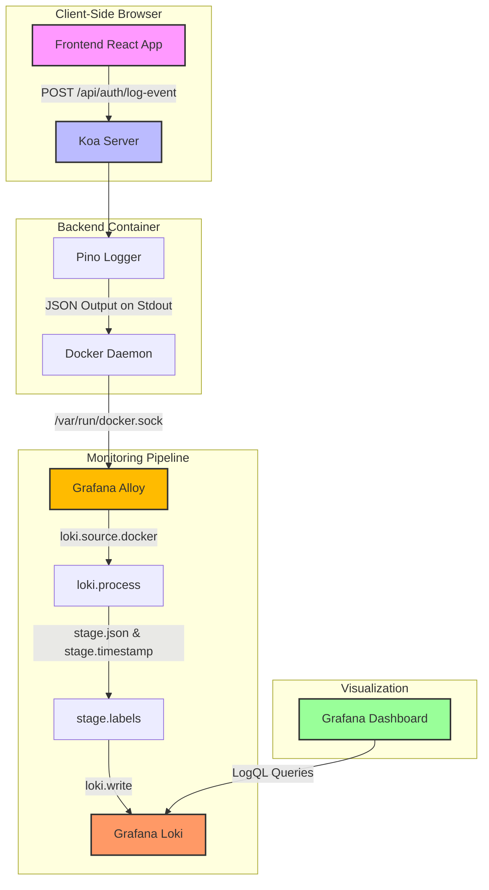

# EzyIntern Observability Pipeline Architecture

This document describes the end-to-end architectural flow of the observability stack implemented in EzyIntern. It details how logs are generated by the Koa backend, collected by Grafana Alloy, stored by Grafana Loki, and visualized on the Grafana Dashboard.

---

## Observability Architecture Diagram



---

## Detailed Step-by-Step Telemetry Flow

### Stage 1: Log Generation (Backend Server)
*   **Responsible Code**: [`utils/logger.ts`](file:///home/sidharthg/sid/project/free/ezyintern/updatedeasy/server/src/utils/logger.ts), [`requestHttp.ts`](file:///home/sidharthg/sid/project/free/ezyintern/updatedeasy/server/src/middlewares/requestHttp.ts)
*   **What Happens**:
    *   The backend uses **Pino**, a high-performance JSON logger. Rather than writing unstructured plain text logs (e.g. `Server started at port 5000`), it writes structured JSON lines:
        ```json
        {"level":"info","time":"2026-06-19T14:29:47.268Z","service":"ezyintern-server","environment":"production","hostname":"5af29e88e0cc","port":5000,"message":"EzyIntern Koa Backend Server started"}
        ```
    *   Every incoming HTTP request goes through the `requestHttpMiddleware` which dynamically computes correlation IDs (`requestId` and `traceId`) and outputs a log with `logType: "http"`.
    *   Activity logs (such as user login/logout forwarded from the client) invoke `audit()`, creating logs tagged with `logType: "audit"`.
*   **Why This is Important**: Structured logging is the foundation of modern observability. It allows subsequent stages (Alloy/Loki) to programmatically read and index specific fields (like `status`, `durationMs`, or `logType`) without using complex, slow regular expressions.

---

### Stage 2: Log Collection (Grafana Alloy)
*   **Responsible Configuration**: [`config.alloy`](file:///home/sidharthg/sid/project/free/ezyintern/observability/alloy/config.alloy)
*   **What Happens**:
    *   Docker writes all container stdout/stderr streams to disk. The root `docker-compose.yml` mounts the system's Docker socket `/var/run/docker.sock` into the `ezyintern-alloy` container.
    *   **loki.source.docker**: Alloy connects to the Docker socket and filters for logs coming from containers with the label `ezyintern.logging: "enabled"` (which includes the Koa backend).
    *   **loki.process (Parser Engine)**:
        1.  `stage.json`: Parses the log line as JSON, extracting inner properties like `time`, `level`, `service`, `logType`, and `status`.
        2.  `stage.timestamp`: Crucially, it parses the custom Pino `time` field using the `RFC3339Nano` format and updates the log entry's timestamp metadata. If this step fails, Alloy uses a `fudge` action to prevent dropping the log.
        3.  `stage.labels`: Promotes the extracted variables (`service`, `logType`, `status`, `environment`) to **indexable Loki stream labels**.
    *   **loki.write**: Sends the labeled log stream over the network to Loki's API endpoint `http://loki:3100/loki/api/v1/push`.
*   **Why This is Important**: Alloy separates the concerns of log transportation from log generation. It transforms raw container output into clean, structured data packages that Loki understands.

---

### Stage 3: Ingestion and Storage (Grafana Loki)
*   **Responsible Configuration**: [`loki.yml`](file:///home/sidharthg/sid/project/free/ezyintern/observability/loki/loki.yml)
*   **What Happens**:
    *   Loki is a "metadata-first" database. Instead of indexing the full text of every log line (which is extremely expensive and memory-intensive), it only indexes the **labels** sent by Alloy (e.g. `{service="ezyintern-server", logType="audit"}`).
    *   Loki groups logs into distinct streams based on these labels and compresses the log text into chunks stored on disk.
*   **Why This is Important**: By only indexing metadata (labels), Loki operates with a tiny fraction of the memory footprint of search engines like Elasticsearch, making it cheap and scalable for production workloads.

---

### Stage 4: Visualization (Grafana Dashboard)
*   **Responsible Configuration**: [`ezyintern-logs.json`](file:///home/sidharthg/sid/project/free/ezyintern/observability/grafana/dashboards/ezyintern-logs.json)
*   **What Happens**:
    *   Grafana runs queries using **LogQL** to scan log streams and turn them into metrics and visual charts in real time.
    *   **HTTP Requests by Status Code**: Computes rate of requests grouped by response status code.
    *   **P95 Request Latency**: Uses `quantile_over_time` to extract the `durationMs` field from the JSON logs and plot the 95th percentile response latency.
    *   **Audit Events**: Streams the raw logs matching `{service="ezyintern-server", logType="audit"}` into a tabular history timeline.
*   **Why This is Important**: It translates cold database logs into actionable business and engineering insights, allowing you to instantly detect payment failures, server outages, or authentication issues.
